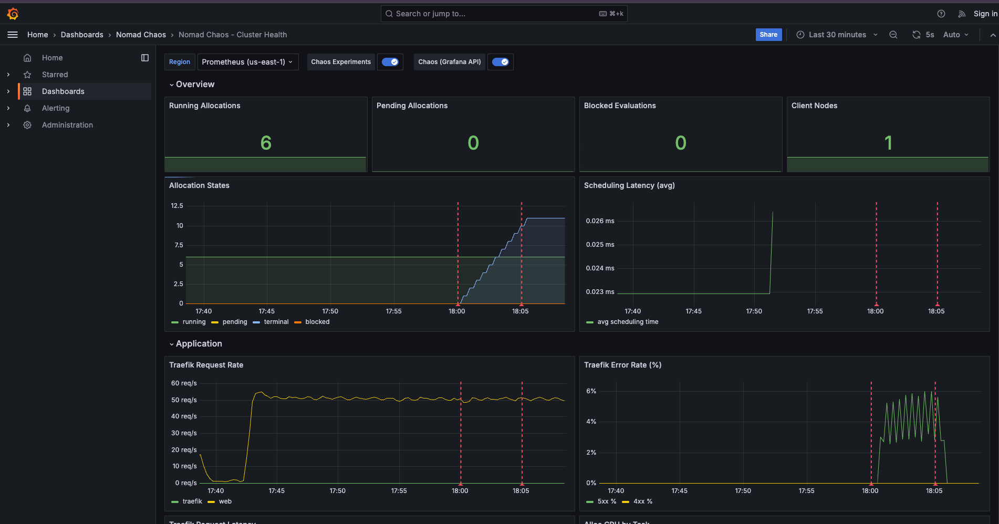
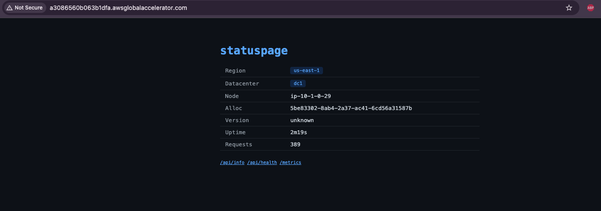
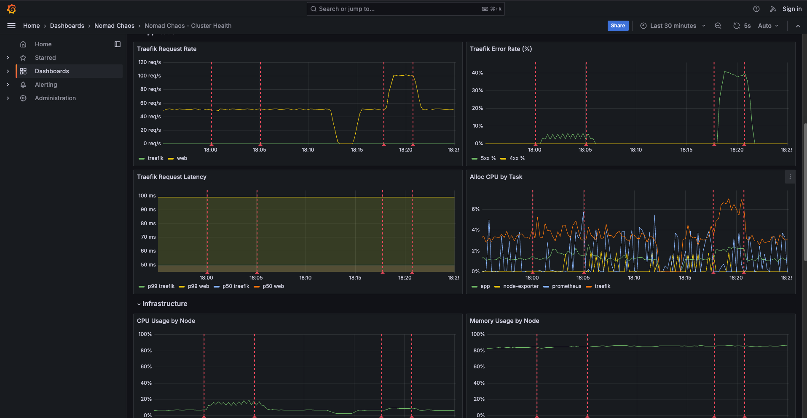

# nomad-chaos

Pretty cheap and simple multi-region chaos engineering lab on AWS. Two federated Nomad clusters run a demo app across `us-east-1` and `us-west-2`, with a custom Go CLI for injecting faults and Grafana for observability.

---

## Screenshots

| Grafana during chaos experiment | App status page |
|:---:|:---:|
|  |  |

---

## Architecture


Traffic enters via Global Accelerator → regional ALBs → Traefik (running as a Nomad system job on every client) → app allocations. The two clusters can talk via VPC peering federate automatically at boot.

| Layer | Tool |
|---|---|
| AMI baking | Packer |
| Infrastructure | Terraform |
| Orchestration | Nomad |
| Service discovery | Consul (cloud auto-join) |
| Reverse proxy | Traefik (Consul Catalog) |
| Traffic shaping | Global Accelerator |
| Networking / access | Tailscale |
| Compute | EC2 spot `t3.micro` |
| Monitoring | Prometheus + Grafana |
| Chaos | Go CLI (`chaos`) |

---

## Lab Setup

### Prerequisites

`packer` `terraform` `nomad` `aws-cli` `tailscale` `docker` `python3`

### Boot the cluster

```bash
./deploy.sh
```

This runs in order:
1. **Packer** — bakes a golden AMI with Nomad, Consul, Docker pre-installed; copies it to both regions
2. **Terraform** — provisions AWS infra
3. **Wait** — polls Tailscale until both Nomad leaders are reachable
4. **Nomad jobs** — deploys jobs to Nomad

All operator access (Nomad API, SSH) goes over Tailscale from my laptop. 

### Monitoring

Grafana runs locally via Docker Compose and scrapes Prometheus on the clusters via Tailscale.

```bash
cd monitoring && docker compose up -d
```

Open [http://localhost:3000](http://localhost:3000).

---

## Example App (`nomad-app`)

A minimal Go HTTP service

| Endpoint | Purpose |
|---|---|
| `GET /` | Status page UI (uptime, region, alloc ID) |
| `GET /api/health` | Health check |
| `GET /api/info` | JSON — region, datacenter, node, version |
| `GET /api/slow?delay=<ms>` | Simulated latency |
| `GET /api/fail?rate=<0-100>` | Simulated error rate |
| `GET /metrics` | Prometheus metrics |

Image: `docker.io/isaaccollins/nomad-app:latest`

The `/api/slow` and `/api/fail` endpoints are intentionally built-in fault injection targets for the chaos tool.

---

## Chaos Tool

Simple CLI tool written in Go. Connects to Nomad and Consul over Tailscale and annotates Grafana on experiment start/stop so every run is self-documenting on the dashboard.

```bash
chaos run <experiment> [flags]
```

| Experiment | What it does |
|---|---|
| `app-fail --rate 50 --duration 60s` | Drive `/api/fail` at 50% across all allocations |
| `app-slow --delay 2000 --duration 60s` | Drive `/api/slow` with 2s delay |
| `kill-alloc --job nomad-app --count 1` | Force-stop a random allocation |
| `kill-loop --job nomad-app --interval 30s --duration 5m` | Kill one alloc every 30s |
| `load --rate 50 --duration 5m` | Generate steady HTTP traffic for baseline |

**Planned:**

| Experiment | What it does |
|---|---|
| `app-ramp --start 10 --end 90 --step 10 --interval 30s` | Ramp failure rate 10→90% |
| `kill-process --node <name> --process nomad` | `kill -9` the Nomad agent on a client |
| `kill-process --node <name> --process consul` | Kill the Consul agent |
| `cpu-stress --node <name> --duration 60s` | Exhaust CPU on a node |
| `shutdown --node <name>` | Full node loss |
| `spot-terminate --node <name>` | Simulate spot termination via AWS API |

---

## Chaos Experiments

Every experiment auto-annotates the Grafana dashboard on start/stop, so the red markers in the screenshots below correspond exactly to when faults were injected.

### 1. Allocation kill loop

```bash
chaos run kill-loop --job nomad-app --interval 30s --duration 5m
```

Kills one random `nomad-app` allocation every 30 seconds for 5 minutes. Tests Nomad's rescheduling speed and whether Traefik drains dead backends fast enough to avoid user-visible errors.


**Observations:**
- Nomad reschedules a killed allocation within a few seconds
- Traefik deregisters dead backends via Consul health checks — brief error window while the check interval catches up
- With 3 allocations across 2 regions, killing one at a time never causes full outage

### 2. Application fault injection

```bash
chaos run app-fail --rate 50 --duration 60s --request-rate 100
```

Drives the `/api/fail?rate=50` endpoint across all allocations at 100 req/s for 60 seconds, simulating a 50% backend failure rate.



**Observations:**
- Traefik Error Rate panel shows the 5xx spike cleanly correlated with the chaos annotation window
- Error rate returns to zero immediately when the experiment ends — no lingering failures
- Request latency stays flat since failures are instant (no queuing or retry storms)
