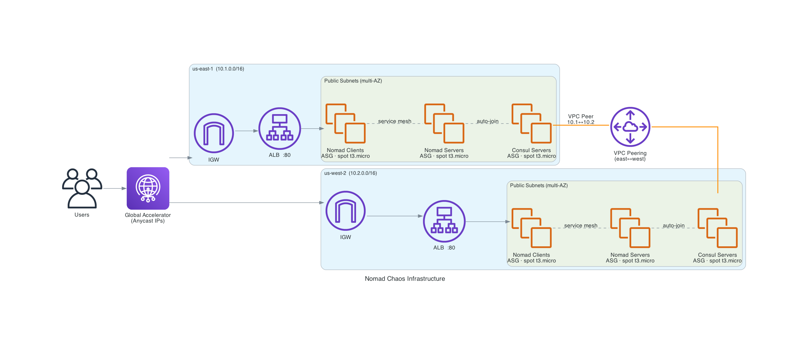

# nomad-chaos

Multi-region chaos engineering lab on AWS. Two federated Nomad clusters run a demo app across `us-east-1` and `us-west-2`, with a custom Go CLI for injecting faults and Grafana for observability.

---

## Architecture



Traffic enters via **AWS Global Accelerator** (anycast) → regional ALBs → Traefik (running as a Nomad system job on every client) → app allocations. The two clusters share a VPC peer and federate automatically at boot via Consul WAN join and Nomad `server_join`.

| Layer | Tool |
|---|---|
| AMI baking | Packer (Ubuntu 22.04) |
| Infrastructure | Terraform (AWS) |
| Orchestration | Nomad (federated, 2 regions) |
| Service discovery | Consul (cloud auto-join) |
| Reverse proxy | Traefik (Consul Catalog) |
| Traffic shaping | AWS Global Accelerator |
| Networking / access | Tailscale mesh VPN |
| Compute | EC2 spot `t3.micro` |
| Monitoring | Prometheus + Grafana |
| Chaos | Go CLI (`chaos`) |

---

## Lab Setup

### Prerequisites

`packer` `terraform` `nomad` `aws` CLI `tailscale` `docker` `python3`

### Boot the cluster

```bash
./deploy.sh
```

This runs in order:
1. **Packer** — bakes a golden AMI with Nomad, Consul, Docker pre-installed; copies it to both regions
2. **Terraform** — provisions VPCs, ASGs, ALBs, VPC peering, Global Accelerator, and security groups
3. **Wait** — polls Tailscale until both Nomad leaders are reachable
4. **Nomad jobs** — deploys Traefik → Prometheus → node-exporter → nomad-app

All operator access (Nomad API, SSH) goes over Tailscale — no public ports required.

### Monitoring

Grafana runs locally via Docker Compose and scrapes Prometheus on the cluster over Tailscale.

```bash
cd monitoring && docker compose up -d
```

Open [http://localhost:3000](http://localhost:3000).

---

## Example App (`nomad-app`)

A minimal Go HTTP service exposing:

| Endpoint | Purpose |
|---|---|
| `GET /` | Status page UI (uptime, region, alloc ID) |
| `GET /api/health` | Health check |
| `GET /api/info` | JSON — region, datacenter, node, version |
| `GET /api/slow?delay=<ms>` | Simulated latency |
| `GET /api/fail?rate=<0-100>` | Simulated error rate |
| `GET /metrics` | Prometheus metrics |

Image: `docker.io/isaaccollins/nomad-app:latest`

The `/api/slow` and `/api/fail` endpoints are intentionally built-in fault injection targets for the chaos tool.

---

## Chaos Tool

CLI tool (`chaos/`) written in Go. Connects to Nomad and Consul over Tailscale and annotates Grafana on experiment start/stop so every run is self-documenting on the dashboard.

```bash
chaos run <experiment> [flags]
```

| Experiment | What it does |
|---|---|
| `app-fail --rate 50 --duration 60s` | Drive `/api/fail` at 50% across all allocations |
| `app-slow --delay 2000 --duration 60s` | Drive `/api/slow` with 2s delay |
| `app-ramp --start 10 --end 90 --step 10 --interval 30s` | Ramp failure rate 10→90% |
| `kill-alloc --job nomad-app --count 1` | Force-stop a random allocation |
| `kill-alloc --job nomad-app --count all` | Kill all allocations simultaneously |
| `kill-loop --job nomad-app --interval 30s --duration 5m` | Kill one alloc every 30s |
| `kill-process --node <name> --process nomad` | `kill -9` the Nomad agent on a client |
| `kill-process --node <name> --process consul` | Kill the Consul agent |
| `cpu-stress --node <name> --duration 60s` | Exhaust CPU on a node |
| `shutdown --node <name>` | Full node loss |

---

## Chaos Experiments

> Results, screenshots, and observations will be added here as experiments are run.

### 1. Application fault injection
*Coming soon — Grafana screenshots of error rate ramp-up and recovery*

### 2. Allocation killing
*Coming soon — Nomad reschedule timings, ALB health drain behaviour*

### 3. Node disruption
*Coming soon — Consul flap detection, alloc migration, CPU/disk saturation metrics*
